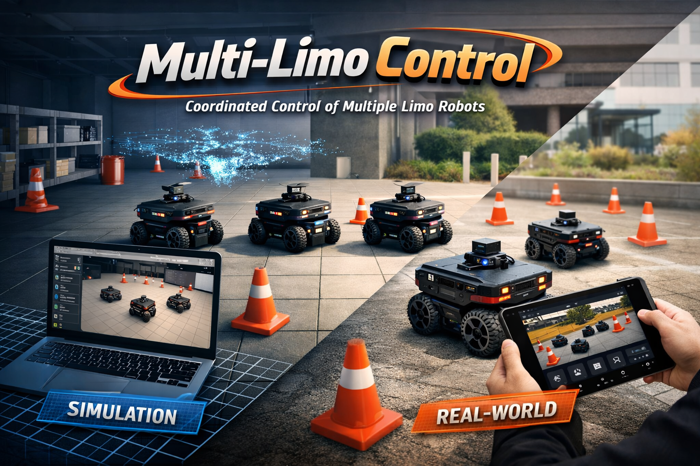
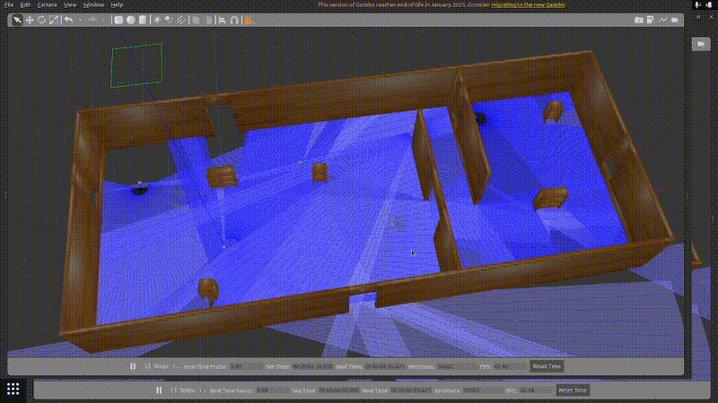
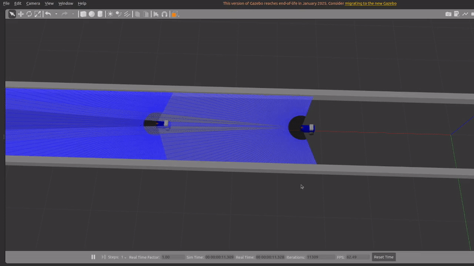
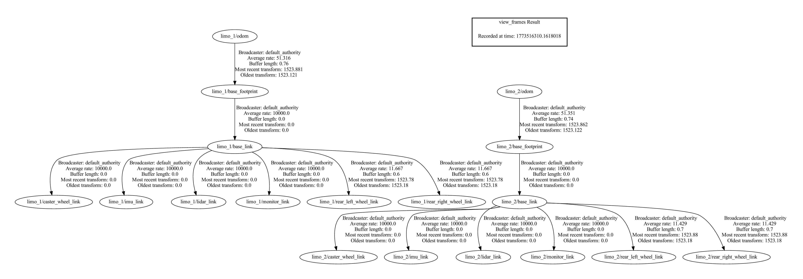
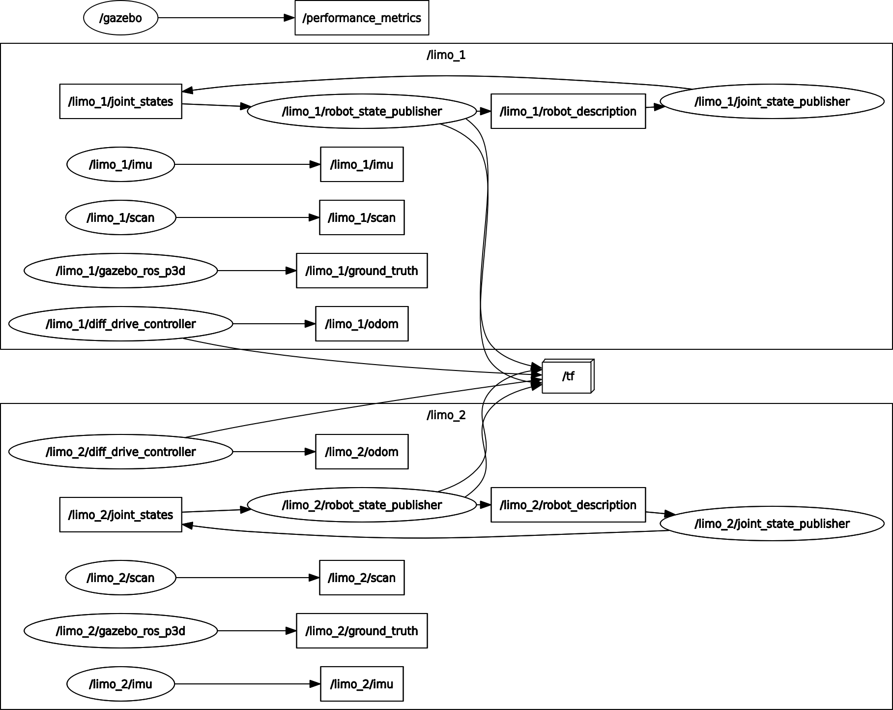

# Multi-Limo-Control
A simple and adaptable robotic testbed to develop and test control algorithms for multiple [Limo ROS2](https://global.agilex.ai/products/limo-ros2) robots.

<div align="center">
    
</div>

<div align="center" style="margin-bottom: 30px;">

[](https://cmake.org/)
[](https://gazebosim.org/)
[](https://www.apache.org/licenses/LICENSE-2.0)
[](https://doi.org/10.1109/IV55156.2024.10588858) <!-- Later change this to the actual DOI-->
<br>

[](https://www.python.org/)
[](https://docs.ros.org/en/humble/)

</div>

## Features

Seamlessly spawn multiple Limos in Gazebo and control them through intuitive and modular interfaces.



Transfer your control stack to real Limos with minimal-to-no adaptations.

| Gazebo | Real World |
|---|---|
|  |  |

<!--Later change this to:

| Simulation (Gazebo) | Real LIMO Robot |
|---|---|
|  |  | -->

## What's included

- A comprehensive yet simple urdf description of the Limo ROS2 robot in differential drive mode with its full sensor suite; LiDAR, IMU, wheel encoders and camera. Sensor noise and all other parameters are configurable.

- Launch files that spawn multiple Limos in Gazebo, each with its own namespace and tf tree.

- Two ready-to-run examples of control algorithms

    1. *Multi Limo Wandering*. Leverage raw LiDAR data to make multiple Limos wander safely around an environment with obstacles. Implementation follows the potential field concept from [The Construct Robotics Institute](https://www.youtube.com/watch?v=WxskRU5KjVQ)
    2. *Adaptive Cruise Control*. Conduct optimal ACC for a Limo with safety distance constraint. Implementation follows our paper [Coming soon!](https://www.youtube.com/watch?v=WxskRU5KjVQ)

## How it works

The repository contains four ros2 packages.

1. **limo_description**. Contains the urdf description of the Limo ros2 robot.
2. **limo_bringup**. Contains launch files that spawn multiple Limos in Gazebo, each with its own namespace and tf tree. Example of the tf tree and ros graph for two Limos:

| tf tree | ros graph |
|---|---|
|  |  |

3. **limo_wander**. Contains the control algorithm for the *Multi Limo Wandering* example.
4. **limo_cruise_control** Contains the control algorithm for the *Adaptive Cruise Control* example.

## How to run

After building and sourcing the repository, bringup the Limo(s)

```bash
ros2 launch limo_bringup gazebo.launch.xml
```

Then, to run the the *Multi Limo Wandering* example 

```bash
ros2 launch limo_wander controller_launch.py
```

and to run the *Adaptive Cruise Control* example, first launch the estimators

```bash
ros2 launch limo_cruise_control estimator_launch.py
```

and then the controllers

```bash
ros2 launch limo_cruise_control controller_launch.py
```

## Contributing

*Multi-Limo-Control* is envisioned to enable fast experimentation and deployment of control algorithms for multi-robot applications. Thus, we welcome contributions! Contributing is as simple as implementing a new ros2 package with your control algorithm in it. Because of the modular design, you just need to spawn as much Limos as you like and communicate to their individually namespaced topics.

## Cite as

If you find *Multi-Limo-Control* useful, please consider citing our paper as  (Coming Soon !)


<!-- [Analyzing the Impact of Simulation Fidelity on the Evaluation of Autonomous Driving Motion Control](https://ieeexplore.ieee.org/document/10588858/). 

```
@INPROCEEDINGS{10588858,
  author={Sagmeister, Simon and Kounatidis, Panagiotis and Goblirsch, Sven and Lienkamp, Markus},
  booktitle={2024 IEEE Intelligent Vehicles Symposium (IV)}, 
  title={Analyzing the Impact of Simulation Fidelity on the Evaluation of Autonomous Driving Motion Control}, 
  year={2024},
  volume={},
  number={},
  pages={230-237},
  keywords={Measurement;Analytical models;Heuristic algorithms;Software algorithms;Approximation algorithms;Data models;Vehicle dynamics},
  doi={10.1109/IV55156.2024.10588858}}

``` -->

## Developers
- Panagiotis Kounatidis. pk586@cornell.edu